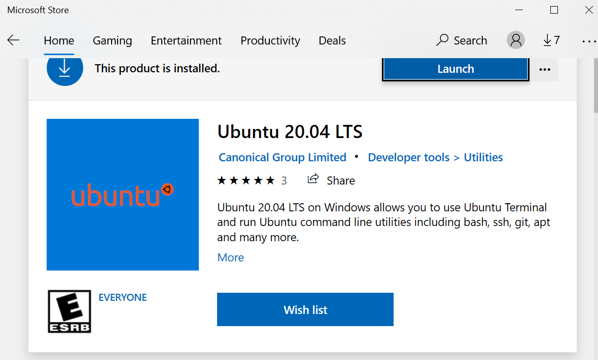
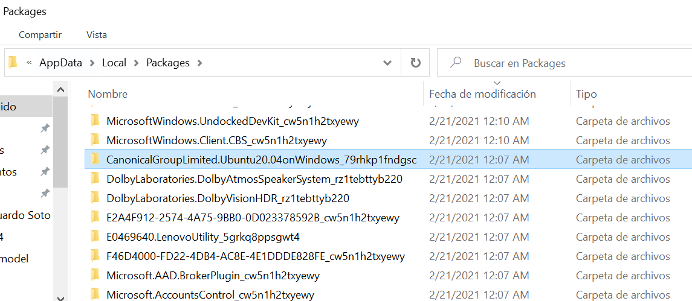
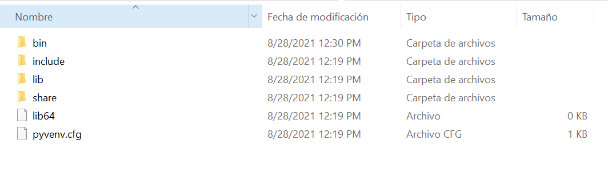

# HOW CREATE A LAMBDA LAYER


### Pre-requisitos:

Ejecutarlo desde Ubuntu 20.04. En windows puede ser instalado desde el microsoft store.
 



Una vez en Ubuntu realizar la configuración inicial
```
sudo apt-get update
sudo apt-get install python3
sudo apt-get install python3-venv
sudo apt install zip
```

Una vez configurado hay que crear una virtual enviroment y hacer la instalación de las librerias. 
Se recomienda hacer la instalación de algunas librerias, ya que el tamaño final de las librerias instaladas no deben sobrepasar los 30mb. Si hay mas librerias que instalar puede tener mas de un layer.

```
python3 -m venv python
source python/bin/activate
python3 -m pip install pandas==1.2.1
python3 -m pip install fsspec==2021.4.0
deactivate
```

Para dirigirse a la carpeta donde se encuentre los paquetes instalados.



```
%userprofile%\AppData\Local\Packages\CanonicalGroupLimited.Ubuntu20.04onWindows_79rhkp1fndgsc\LocalState\rootfs
```


Ingresar a la carpeta y eliminar todas excepto la carpeta lib



Renombrar la carpeta con nombre python y comprimir la carpeta. Y subir el archivo como lambda layer 
